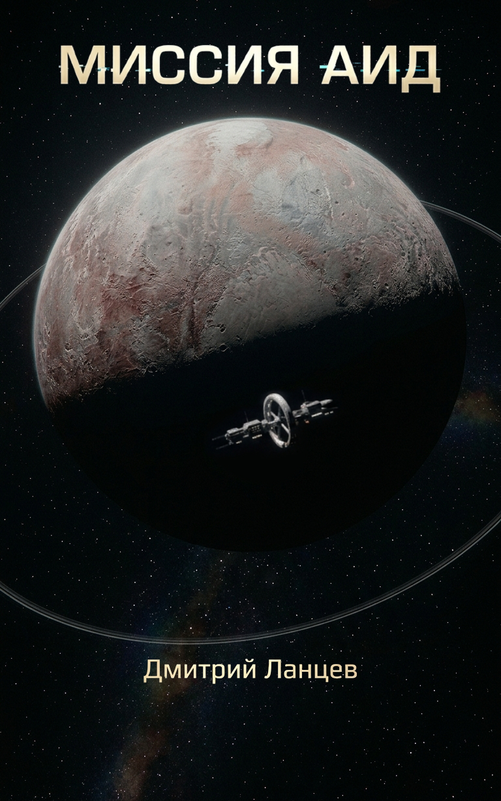

МИССИЯ АИД

## Часть 1 — Дэйв

Город пустой. Фонари горят еле-еле. Дальше только тьма. 

Я иду. Шаги гулкие, пустые. 

Впереди фигура. Идёт на меня. Фонарь над нами начинает мигать. Чаще. Быстрее. 

Он поднимает голову. 

Лица нет. Гладкая кожа от лба до подбородка. 

Он обхватывает меня за плечи. В груди пустота. 

— Не бойся. 

Мы загораемся. Вспышка света. Вырывается из каждой клетки. 

Открываю рот — и свет выходит наружу. 

Просыпаюсь. 

Снова. 

 

Сердце колотится в груди. Простыня под спиной мокрая от пота. Холодная. Лежу, смотрю в потолок. К горлу подступила тошнота. 

За окном мигает фонарь. 

Сажусь. Голова тяжелая. Во рту горечь. 

Форма висит на спинке стула. Синяя, с нашивкой на рукаве. 

Встаю. Босые ноги оставляют следы на холодном полу. 

В коридоре темно. На потолке горят тусклые панели. 

Душ дальше по коридору. Вода холодная. Включаю на полную. Пальцы дрожат. От холода. Или от страха? 

Возвращаюсь в комнату. Форма все еще на месте. Фонарь за окном все еще мигает. 

Сажусь на край кровати, смотрю на планшет. 05:47. Непрочитанное сообщение. 

«Старт 30.03.2093. 10:00. Всем быть готовыми». 

Я смотрю на текст. Внутри ничего. 

Говорил же, что не хочу лететь. Не потому, что трудно. Просто незачем. 

 

Надеваю спортивный костюм. Затягиваю шнурки. 

Выхожу на крыльцо. Туман в низине, белый, густой. Солнца еще нет, но восток светлеет. Горы на фоне неба как вырезанные из картона. 

Начинаю бежать. 

Сначала медленно, потом набираю темп. Туман рассеивается, выбегаю на главную улицу. Городок почти мёртвый. Жителей в нем мало, только те, кто работает на базу. Дома пустые, ещё отцовского времени. Бегу мимо брошенной школы, мимо магазина с вывеской, которую ветер почти сорвал. Ни души. 

 

Тут солнце выходит из-за гор. Свет ложится на лицо. Тёплый, живой. На секунду отпускает. Сон как сон, чего я к нему прицепился. 

 

Бегу назад, скоро на работу. 

Захожу в дом, пот течёт. Душ. Ледяная вода. Надеваю форму. Смотрюсь в зеркало. Астронавт с медалями и пустыми глазами. 

На кухне сковорода шипит. Два яйца, пара колбасок. Жевать не хочется, но надо.  

Стук в дверь. 

 

На пороге Стив. Улыбается. Форма на нём сидит безупречно, даже галстук правильно повязал. Еще бы, помощник руководителя операции.  

Как всегда, входит без приглашения. 

 

— Ну что, готов покорять космос? 

— Готов, чтобы ты закрыл дверь с той стороны, — говорю я. — Есть будешь?  

— Нет. Хелена покормила. Не хочу, чтобы ты меня отравил. 

— Ты себя отравишь, если не перестанешь пить эту бурду, которую называешь кофе. 

— А это тебя не касается. 

— Я твой друг, меня все касается. 

 

Стив смеется. Он всегда смеётся. Я надеваю куртку, проверяю карманы — ключи, пропуск, больше ничего не нужно. 

 

— Поехали. 

 

У него старый «Форд», салон пропах кофе и какой-то фруктовой жвачкой. Стив за рулем, пьет месиво из стаканчика. Выезжаем за шлагбаум. 

 

— Как Хелена? — спрашиваю я. 

— Она отлично. Рожать скоро. 

— Чего? 

— Слышал же. Второй на подходе. 

 

Я смотрю на него. Он улыбается, но глаза серьёзные. Стив — единственный человек, который не врёт, когда улыбается. 

 

— Почему я не в курсе? 

— Потому что хотел сказать лично, а не через сообщение. 

— Понятно. Поздравляю. Боишься? 

— Трясусь. А кто не боится? 

 

Дорога пустая. С обеих сторон — голые холмы и редкие кусты. База скрыта за подъёмом, но я знаю, что там, за поворотом. 

 

— А ты? — спрашивает Стив. — Семью не хочешь? 

— Мне бы на Земле задержаться для начала. 

— Задержишься. Вот вернёшься — сразу к делу. Я тебя познакомлю с подругой Хелены. Высокая, блондинка, ноги от ушей. Такая же серьезная, как ты. 

— Ты меня с одной уже познакомил. Француженка, красивая, учёная в третьем поколении… — отмахиваюсь я. 

— Ты мне до конца жизни Мишель вспоминать будешь? 

— Ещё бы. Так что, отстань со своими подругами. 

— Я серьёзно, тебе уже сорок. Ты хочешь семью, или ты космос выбрал? 

 

Я молчу. Стив не давит. 

 

Дорога идёт в гору. За поворотом открывается долина. И там стоит она. 

Огромная. Самая большая, какую я видел вживую ракета. Солнце бьёт в обшивку, отражается слепящими лучами. Вокруг суетятся люди, машины, краны. Но сама она — неподвижная, холодная, абсолютная. 

Я смотрю на неё, и внутри всё сжимается. 

 

— Нас как муравьёв посадят на нос этой штуки и закинут в космос. 

 

Стив только молча взглянул на меня. Сбавляет скорость, сворачивает к КПП. 

Мы едем молча. Я не могу оторвать взгляд от ракеты. Она не выглядит грозной. Но окончательной. 

 

Дорога выводит нас к КПП. Шлагбаум. Будка. Охранник в синей форме выходит, держит планшет.  

Стив опускает стекло. Охранник подносит планшет — короткий писк, зеленая подсветка. Сканирует лицо. Потом моё. Я смотрю прямо в объектив, не моргаю. Данные те же. Лицо то же. Каждое утро одно и то же. Будто за ночь мы могли измениться. 

 

— Командир Джонс, — кивает он. — Мистер Транкин. 

 

Шлагбаум поднимается. 

Въезжаем на парковку. Стив глушит двигатель. Ракета перед глазами. 

Сидим молча. 

 

— Дейв, — говорит Стив. — Тот сон. Он тебе все еще снится? 

 

Я смотрю на него. Он не отводит взгляд.  

Киваю. Медленно. 

 

— Сколько уже? Два года? Три? 

— Почти три. 

 

Стив молчит. Смотрит на руки, лежащие на руле. Потом снова на меня.  

— Психологи хотели снять тебя с миссии. На прошлой неделе собиралась комиссия. 

 

У меня холодеет внутри. 

 

— Я сказал, что ты в порядке, — продолжает он. — Что это просто стресс перед полетом. У всех бывает.  

— А если не в порядке, Стив? 

 

Он смотрит на меня. 

 

— Ты самый опытный астронавт из всех, кто у нас есть. Пять полетов на Марс. Три — главным пилотом. И сколько раз ты садился на Луну? Сейчас ты командир. Если ты не полетишь — не полетит никто. 

 

— Стив… 

— Я поручился за тебя. Сказал, что отвечаю. 

 

Молчу. 

 

— Не подведи, — говорит он. Улыбается, но глаза серьёзные.  

Я киваю. 

Он хлопает меня по плечу, открывает дверь, выходит. Я следом. 

 

Мы вошли в центр управления. Коридоры длинные, пустые, стены из бетонных блоков, просто покрашены. Лампы гудят ровно, без мигания. Наша обувь стучит по бетонному полу, звук разносится эхом.  

Через два поворота и один пролёт лестницы — штаб. Двери массивные, металлические, двойные. Стив подходит к сканеру, и они с шипением расходятся. 

Внутри уже все. 

 

Я оглядываюсь. В комнате человек двадцать. Инженеры, техники, обслуживающий персонал. Среди них — наши. Тейлор, Хиро, Елена, Мишель. И я. Пять человек. Вся команда, которая стартует с Земли. 

 

Я прохожу к своему месту. Стив садится, открывает планшет. 

 

— Доброе утро, — говорю я. 

 

Поднимают головы. Кивают. Кто-то тихо, кто-то громче. 

 

На планшете появляется Джимми, главный аналитик. Он на орбите Марса. 

 

— Кэп, стартовое окно подтверждено. 

 

Я киваю. Сажусь в кресло. 

 

Открываю доклад. Вверху — гриф секретности, дата и название: 

 

МИССИЯ «АИД» КОРАБЛЬ «ХИМЕРА-3» 

 

Листаю дальше. Всё в порядке. Цифры как цифры. 

 

 

Я замечаю движение в дверях.  

Все резко разворачиваются. Вскакивают. Руки взлетают к вискам. Я тоже встаю, отдаю честь.  

В проеме стоит Генерал.  

Седые волосы. Лицо грубое, и острый взгляд. Раньше я видел его только на совещаниях. Редкий гость для нас. 

— Вольно, — говорит. Голос низкий, приказной.  

Мы опускаем руки, но никто не садится.  

Генерал обводит взглядом комнату. Медленно. По очереди. Когда его глаза доходят до меня, взгляд задерживается. 

— Команда в сборе? — спрашивает.  

— Земные астронавты в сборе, сэр, — отвечаю я. — Остальные ждут на орбитах Луны и Марса. Проверяют центрифугу с оборудованием.  

Генерал кивает. Делает паузу. 

— Желаю удачного полета, — бросает напоследок и выходит.  

Двери закрываются. Через время Стив подходит ко мне. 

— Генерал Кейн. Перевели сюда из минобороны полгода назад. Раньше курировал проект «Страж». Помнишь такой?  

Я молча киваю. 

— Жуткий тип, — продолжает Стив, наклоняясь ближе. — Говорят, ему достаточно взгляда, чтобы понять, что ты за человек..  

— Ну, — говорю я, — похоже, на мне он запнулся. 

Стив усмехается. Кладет руку мне на плечо.  

— Всё в порядке. Ты тот, кто нам нужен. 

Стив уже собирается отойти, когда к нам подходит Мишель.  

— Что шепчетесь, девочки?  

— Ты как разговариваешь со старшими по званию? — говорю я, улыбаясь.  

Она смотрит на меня. Один уголок губ поднимается.  

— Старшими по званию? — переспрашивает. — Я геолог третьего поколения. Моя бабка образцы с Луны таскала, пока твой отец еще в песочнице сидел.  

— Мой отец на Марсе был, когда твоя бабка ещё с Луной возилась.  

— И оба не дожили, — вставляет Стив. — Чтобы научить вас здороваться. 

 

Он тихо смеётся, отходит к своему месту. 

 

 

Мы остаёмся вдвоём. Она смотрит на мою форму, потом протягивает руку и поправляет галстук. Пальцы задерживаются на секунду дольше, чем нужно. Я чувствую её запах. Что-то цветочное, хотя знаю — она не пользуется духами перед стартом. Наверное, шампунь.  

— Ты и ее с собой потащила? — киваю в сторону Елены.  

— Она работает со мной. 

— Но она в космосе была два раза. Разумно?  

— Справится лучше тебя. Мы прожили с ней полгода на орбите Марса, изучая аномалию.  

— Аномалия... — усмехаюсь я. — Это твоё волшебное слово, которое запудривает мозги даже начальникам?  

Она не улыбается. Смотрит на меня в упор.  

— Ты считаешь, что она плохой специалист? Или это из-за меня?  

Я отвел взгляд.  

— Дэйв, — говорит она тихо. — Елена нужна. Не спорь.  

Я смотрю на неё. Она обводит меня взглядом. 

— Как твоя бессонница? 

— Нормально. 

— Врёшь. 

Смотрю на неё. Она смотрит на меня.  

— Высыпаюсь, — говорю. 

Кивает. Знала ещё тогда. Слышала, как я кричу по ночам. Видела, как просыпаюсь в холодном поту. Никогда не спрашивала. Гладила по голове, пока дыхание не выравнивалось. 

 

— Мишель… — начинаю я.  

— Потом, — перебивает она. — Работа. 

 

После ухода генерала напряжение спадает, но не уходит. Оно просто меняет форму — становится рабочим.  

— Всем занять места, — говорю я. — У нас ровно пятьдесят часов до старта. Проверяем всё. Расходимся.  

Хиро уходит в технический отсек. Проверка систем жизнеобеспечения, топливных магистралей, герметизации. Я слышу его голос из открытого люка: «Давление в норме», «Клапан номер четырнадцать перекрыт». Работает один. Как всегда.  

Тейлор сидит перед экранами связи. Гарнитура на голове, пальцы бегут по клавиатуре. Проверяет каналы — с базой на Луне, с орбитальной станцией у Марса, с центром управления на Земле. Короткие фразы: «Прием, проверка связи», «Сигнал чистый», «Потери нет». Я смотрю на него пару секунд. Он не отвлекается. 

Елена с планшетом в грузовом отсеке. Каталогизирует груз. Открывает контейнеры, сверяет маркировку, закрывает. Керны, пробирки, анализаторы. Работает аккуратно, но я замечаю, как пальцы чуть дрожат, когда она перекладывает хрупкие образцы. 

— Всё на месте? — спрашиваю.  

— Так точно, командир.  

— Мишель сказала, что ты справишься.  

Она поднимает голову. Улыбается. Неуверенно, но благодарно.  

— Я постараюсь.  

Мишель пишет что-то на экране. 

— Ты должна быть с Еленой. Груз сам себя не разберет.  

— Я проверила свой груз два часа назад. Всё на месте.  

Она смотрит на тень от ракеты. Молчим.  

— Ты выходишь на Квавар первым, — говорит она. — Первый, кто забрался так далеко.  

— Знаю.  

— Не геройствуй. 

— А кто будет?  

Она поворачивается ко мне. Глаза серьёзные.  

— Дэйв.  

— Всё будет нормально. Мы же будем там все вместе.  

Звонок. 

 

— Дэйв, зайди на минуту. У нас корректировка по экипажу. — Стив серьезен. 

Я иду по коридору. За моей спиной — шаги. Мишель. 

Мы входим в переговорную почти одновременно. Стив стоит у длинного стола, листает планшет. 

— Дэйв. Мишель.... — Он замолкает. Смотрит на нас. — Садитесь.  

Мишель села рядом. Стив напротив.  

— Комиссия постановила, — говорит он. Пауза. — Маркус Ли, криобиолог, включен в экипаж вместо прежнего врача. 

— Это всё? — спрашиваю.  

— Всё. 

  

Смотрю на Мишель, на Стива.  

— Ты мог сказать это по связи, — говорю.  

— Мог, — соглашается Стив. — Но этот разговор с глазу на глаз.  

— Есть вопросы?  

— Есть. На сколько целесообразно менять специалиста перед стартом? 

— У нас нет другого выбора, Дэйв. Приказ подписан, комиссия вынесла свое решение. Говорят, он жаждет с тобой познакомиться.  

— Где он сейчас? Я хочу его увидеть до старта. 

— Он на Марсе. — встревает Мишель. 

— Ты знала? — спрашиваю тихо. 

Она смотрит на меня.  

— Да.  

— Ну конечно ты знала… И не сказала. 

— Не хотела, чтобы ты психовал раньше времени. 

— Я не психую. 

— И что бы ты сделал? — спрашивает Мишель. — Отказался бы? Миссия без крио-специалиста, просто самоубийство. И ты это знаешь. 

— Можно было бы не замораживаться и вовсе. 

— Да, и тогда к Квавару долетит измотанная, спятившая восьмерка! 

— И это еще я психую? — спрашиваю я Стива. 

— Дэйв, нам нужна холодная голова. — выдохнул Стив встая, — Давайте обговорим все завтра. 

 

Карантинная казарма. Белые стены, узкие кровати, вентиляция гудит. Нас посадили сюда за двадцать четыре часа до старта. 

 

Шесть часов до старта. 

 

Лежу на койке, смотрю в потолок. Справа — Мишель. Дышит ровно, но не спит. Дальше — Хиро. Не слышно. Елена всхлипывает раз в десять минут. Тейлор стучит пальцем по спинке кровати. 

 

Закрываю глаза. Пытаюсь представить что-нибудь спокойное. Дом. Пустой холодильник. Форма на стуле. Фонарь за окном. Лицо из сна. 

 

Один час до старта. 

 

Финальная проверка скафандров. Только шипение кислорода и щелчки замков. 

 

— Всем проверить связь, — говорю в гарнитуру.  

Откликаются все. Голоса спокойные.  

— «Логос», — говорю. — Финальная диагностика систем.  

— Все системы в норме, — отвечает ИИ. — Рекомендуемая температура перед стартом — 18 градусов. Снизить?  

— Да. 

— Температура снижена. Активирован предстартовый протокол. 

— Спокойной ночи, «Логос». — говорю я. 

— Удачного полета. 

 

Полчаса до старта. 

 

Мы на местах. Никто не говорит. В кабине слышно только дыхание пяти человек и гудение систем. 

До старта — десять минут. 

Я смотрю на свои руки. Они не дрожат. 

Пять минут. 

Смотрю на Мишель. Она смотрит на приборы. Сосредоточена. 

Три минуты. 

Я пробегаю взглядом по панели. Все индикаторы зеленые. 

Две минуты. 

Елена закрывает глаза. Шепчет что-то. 

 

Сердце стучит. Вдох. Выдох. 

 

В динамике голос из центра управления, сухой, официальный: «Две минуты до пуска. Финальная проверка». 

 

В наушниках шипение, потом голос Стива. Не официальный. Свой. 

 

— Дэйв, — говорит он. — Я тут с Хеленой поговорил. Она сказала, что если вы все вернётесь, назовем сына в честь кого-нибудь из вас. 

 

Я смотрю на Мишель. Она смотрит на меня. Краем глаза вижу, как она улыбается. 

 

— Я лично не хочу, чтобы моего ребёнка звали Мишель, если это будет мальчик, — продолжает Стив. 

 

Мишель закатила глаза. — Стив, это очень мило, — говорит она. — Поздравь Хелену. 

Тейлор усмехается. 

 

— Стив, назовешь сына Стивом — он тебя не простит. Я как Дэвид-младший знаю. 

— А если Дэйвом? 

— Тогда попрошу тебя не прощать. 

 

Стив смеется. Щелчок динамика. 

 

«Пять... Четыре... Три... Два... Один... Старт.» 

 

Резкий удар. Меня вдавливает в кресло. Грохот топлива оглушает. Мир сжался в одну точку. Корпус гудит. Вибрация проходит сквозь кости. 

С трудом поворачиваю голову. Смотрю на Елену. Глаза закатились, голова упала набок. 

Вырубилась. 

 

— «Логос», состояние Елены Петровой. 

— Пульс 120, дыхание ровно. Зарегистрирована потеря сознания. Придёт в себя через 15–20 секунд. 

 

Смотрю на остальных. Все показывают большой палец. 

Перевожу взгляд на приборы. Высота, скорость, ускорение. Всё идёт по плану. 

 

Перегрузка отпускает. 

 

Тело становится лёгким, почти невесомым. Желудок подкатывает к горлу, но я уже привык. 

 

Земля внизу. Маленькая. Голубая. Мы оторвались.  

 

Смотрю в иллюминатор. Видел это больше сотни раз, но каждый раз замираю. Голубая, тонкая атмосфера с волосок. Под ней океаны, облака. 

Я чаще видел её отсюда, чем с поверхности. 

 

— Члены экипажа, доложить состояние, — говорю в гарнитуру. 

 

Откликаются по очереди. Елена уже пришла в себя, голос слабый. Хиро, как всегда, коротко: «Норма». Тейлор: «Системы связи в норме». 

 

— Центр управления, — вызываю я. — «Химера-Альфа-3» на связи. Подтвердите выход на орбиту. 

 

Шипение. Треск. Тишина. 

 

— Командир, — голос Тейлора. — С нашей стороны всё чисто. Сигнал идёт. Но с Земли не отвечают. 

 

Я смотрю на панель связи. Индикаторы зелёные. Уровень сигнала — полная шкала. Но тишина. 

 

— Центр управления, — повторяю я. — «Химера-Альфа-3» вызывает Центр. Приём. 

 

Ничего. 

 

— Тейлор, разберись. 

— Есть. 

 

Он отстегивается от кресла. Движения неуклюжие — первые секунды невесомости всегда застают врасплох. Отталкивается от подлокотника, плывёт к отсеку связи. 

 

— «Логос», диагностика систем. 

— Все системы в норме, — отвечает голос в наушнике. — Зафиксирована внешняя электромагнитная помеха. Мощность незначительная. Защита корабля сработала штатно. Потеря связи с наземными станциями, временная. 

— Причина? 

— Предположительно солнечная активность. Вероятность повторения низкая. 

— Вспышка, — тихо говорит Мишель. 

 

Я смотрю на неё. Она смотрит на экран. 

 

— Слабая, — добавляет она. — Достаточная, чтобы повалить старые системы на Земле. Но «Химера» защищена. 

— Откуда ты это знаешь? 

— Предполагаю. Сейчас у меня нет данных. Я готовила этот модуль для путешествия к эпицентру. Многослойный экран, усиленная защита. Должно было выдержать. 

— Должно было? 

 

Она смотрит на меня. 

 

— Теперь я знаю точно. 

— «Логос», проверь защитные экраны. 

— В пределах нормы. Повреждений нет. 

 

Я смотрю на Землю. Голубая. Тонкая. Молчащая. 

 

— Следуем по плану. «Логос», курс на Луну. 

— Курс проложен, — голос в наушнике. — Прибытие через семьдесят два часа. 

Мы летим. Земля остаётся позади. Наверное, сейчас там суета, все чинят вышедшие системы. А мы тут, в невесомости, в тишине. 

 

  

Прошло более суток.  

— Командир, — голос Тейлора. — Сигнал появился. Лазерный канал нестабилен, но радиочастотный резерв работает.  

В наушниках шипение, потом голос Стива. Усталый, с хрипотцой.  

— «Химера-Альфа-3», вызывает мыс Канаверал. Приём.  

— Мыс Канаверал, — отвечаю я. — Слышу вас с помехами.  

— Дэйв... — облегчение в его голосе такое явное, что я почти вижу его. — Слава богу. Мы думали... — голос проваливается в шум, потом возвращается. — У нас тут глобальный сбой. Не только у нас. Половина наземных станций легла.  

— Причина?  

— Вспышка. Слабая, но зацепила старые системы. Новая техника уцелела.  

Мишель поворачивается.  

— Стив, — говорит она. — Мощность?  

— Невысокая. Пороговая. Ваша защита сработала штатно.  

— А данные по аномалии? — спрашивает она. — Пик активности?  

 — Зафиксирован за шесть часов до старта. — Стив отвечает быстро. — Совпадает с моментом потери связи.  

  

Мишель кивает.  

— По циклу она не должна была совершить выброс сейчас, — тихо говорит она. 

— Но слабая мощность... возможно, скопленная энергия сорвалась случайно. Или побочный эффект.  

— Что это значит? — спрашиваю я. 

— Это значит, что мы не знаем. — Она смотрит на меня. — Не знаем, почему она ударила. Не знаем, повторится ли. Не знаем, когда. Единственное, что мы знаем — «Химера» выдержала. В этот раз.  

Стив помолчал, подождал, затем продолжил:  

— Дэйв. У вас всё нормально?  

Я смотрю на Мишель. Она смотрит на меня. Молчит.  

— Всё нормально, — говорю я.  

— Когда вы вышли на орбиту и связь пропала. Мы подумали... — он не договаривает.  

— Я знаю, у нас все отлично, Стив. 

— Да. — помолчал он, — Хорошо. — Пауза. Шум. — Удачи.  

Связь обрывается. Снова шипение.  

В кабине тишина. Мишель отворачивается к иллюминатору.  

— «Логос», — говорю. — Отметь в журнале: потеря связи из-за вспышки, восстановление через двадцать пять часов.  

— Отмечено.  

Я смотрю на Землю. Она становится всё меньше. 

Луна появляется из темноты. Сначала серп, потом край кратера, потом вся. В трещинах, в шрамах от бесчисленных ударов. Безжизненная. Холодная. Но на её поверхности — жизнь.  

 

На тёмной стороне горят огни. База «Селена-1». Купола, ангары, вышки связи. Дороги, проложенные по реголиту, тянутся от шахт к перерабатывающим заводам. По ним движутся роверы-добытчики. Автономные. Огромные. Размером с дом. Я вижу их даже с орбиты — тёмные силуэты на серой равнине, медленно ползут к горизонту. Тащат за собой груженые прицепы. Ни людей. Ни звука. Только машины, которые работают уже годы без остановки. 

 

На орбите, в тени Луны, висит станция «Селена-2». 

Она не похожа на те станции, что показывают в новостях. Нет гладких обводов, нет пафосных ангаров. Только фермы, сотни метров в длину, собранные из лунного металла. Между ними — доки. Огромные, пустые сейчас. Когда-то здесь строили межпланетные корабли. Сейчас здесь тихо. Только один модуль остался пристыкованным к дальнему доку. Конкуренты с Марса перетянули все заказы к себе. 

Станция живёт своей жизнью. ИИ управляет кранами, сварочными дронами, системами жизнеобеспечения. Инструменты пристегнуты к стенам. На панелях управления — векторы сборки, чертежи, графики поставок. Люди здесь бывают редко. Сейчас на станции двое. Они провели здесь три недели. Проверяли герметичность, тестировали системы, ждали нас.  

Этот модуль — «Химера-Бета-3». Цилиндр пятнадцать метров в длину, восемь в ширину. С двумя стыковочными узлами по бокам. Снаружи — термоизоляция, иллюминаторы, навигационные огни. Внутри — спальные места, санузел, запасы. Просто. Функционально. Всё, что нужно для перелёта к Марсу.  

Главное — к его центральному узлу будет крепиться кольцо центрифуги. Там, на орбите Марса, он станет осью, вокруг которого будет вращаться лаборатория, рубка, спальни и прочее. Без него мы просто металлическая банка в вакууме. С ним — дом на годы.  

На корпусе мигают огни — красный, зелёный, белый. В иллюминаторах горит свет. Там ждут.  

— «Логос», запроси стыковку с «Химера-Бета-3». 

— Модуль на связи. Передаю данные. 

В наушниках голос Дэнни Веги. Спокойный, с хрипотцой. 

— «Альфа», вас вижу. Стыковка разрешена. 

— Отлично. Готовьтесь. Через двадцать минут будем внутри. 

Стыковка началась. 

— Скорость 0.5. Расстояние десять метров. 

— Принял. 

Сбросил ещё немного. Три метра. Два. Один. 

Мягкий удар. Корпус дрогнул. Отсеки сцепились. 

— Стыковка завершена. Герметичность подтверждена. 

Я откинулся в кресле. 

— «Бета», как слышите? 

— Слышу отлично. Стыковка чистая. Добро пожаловать на борт. 

Я выдохнул. 

— Открываю переходной люк. 

 

Щелчок. Шипение пневматики. Люк между нашими модулями медленно пошёл в сторону. С той стороны уже ждали двое.  

Первый — крупный, с широкими плечами, рыжая борода. Лет сорок, не меньше. Остановился в проеме, оглядел наш отсек, кивнул.  

— Командир Джонс? — спросил.  

— Так точно.  

— Марти Беккер, механик. — он протянул руку. Я пожал. Ладонь широкая, твердая. — Три недели тут торчим. Заждались вас. 

Второй протиснулся следом. Помоложе, подтянутый, темнокожий, коротко стриженные волосы. Лицо спокойное, даже чуть сонное, но глаза живые — быстро оценивают обстановку.  

— Дэнни Вега, — сказал он. — Второй пилот. — Посмотрел на меня. — Командир Джонс? Наслышан о вас. Рад быть в одной команде.  

Я кивнул.  

— Дэнни. У нас всё готово?  

— Так точно. Модуль проверен, запасы на месте. Ждали только вас.  

— У вас была связь с Землёй? — спросил я.  

Марти и Дэнни переглянулись.  

— Была, — ответил Дэнни. — До вспышки. Потом пропала. Восстановилась часов шесть назад. — Он помолчал. — Мы слышали, вы тоже были в провале.  

— Да, — сказал я. — Сутки молчания.  

Дэнни кивнул. Посмотрел на Мишель. Она висела у пульта, не вмешивалась в разговор, но я видел, как она внимательно слушает.  

— Мишель Дюваль? — спросил он. — Ради вас, говорят, вся эта экспедиция затеялась.  

Она подняла бровь.  

— Не вся.  

— Ну, львиная доля, — Дэнни усмехнулся.  

— Доложите о готовности, — перебил его я.  

Он мгновенно посерьезнел.  

— Всё готово. Джимми на Марсе подтвердил, центрифуга в порядке. Док на месте, уже изучает детали. 

 

Я перевёл взгляд на карту. Курс к Марсу открыт.  

— Через час выходим, — сказал я. — Всем занять места.  

— Есть, командир, — сказал Марти. — Мы уже всё подготовили. Модуль загружен, системы проверены.  

Они развернулись и поплыли обратно в свой отсек. Я смотрел на стыковочный узел. Теперь этот цилиндр — часть «Химеры-3». Дополнительные спальные места, запасы, санузел. Не роскошь, но на два-три месяца до Марса хватит.  

— «Логос», — сказал я. — Отстыковка от станции по готовности.  

— Принято. «Селена-2» подтверждает отстыковку. Желают удачи.  

Я усмехнулся. Станция остаётся на орбите. Дальше мы сами.  

Мишель подплыла ко мне. Остановилась рядом, смотрела в иллюминатор.  

— Как ты? — спросил ее я. 

— Нормально.  

— А ты? 

Я не ответил. 

— Ещё немного, и мы у цели.  

— Ещё немного, — повторила она.  

Корабль дрогнул. Мы отстыковались от «Селены-2». Станция медленно поплыла в сторону, скрылась в темноте. Впереди был только Марс.  

— Курс проложен, — объявил «Логос». — До Марса — восемьдесят семь дней. Рекомендую распределить вахты.  

Я кивнул. Восемьдесят семь дней в тесноте, в невесомости. Потом — Марс, центрифуга, гравитация. А потом — долгий путь к аномалии. 

— Распределяю вахты, — сказал я. — Хиро, ты первый. 

Хиро молча занял место у приборов. Пристегнулся. Остальные разошлись по модулям. 

Я остался у иллюминатора. Луна уходила назад. Голубая точка Земли становилась всё меньше. 

— «Логос», — сказал я. — Отметь в журнале: стыковка с модулем «Селена-2» завершена. Экипаж пополнен. Курс на Марс. 

— Отмечено. 

Я закрыл глаза. Впереди — долгий путь. 

 

Продолжение следует... 